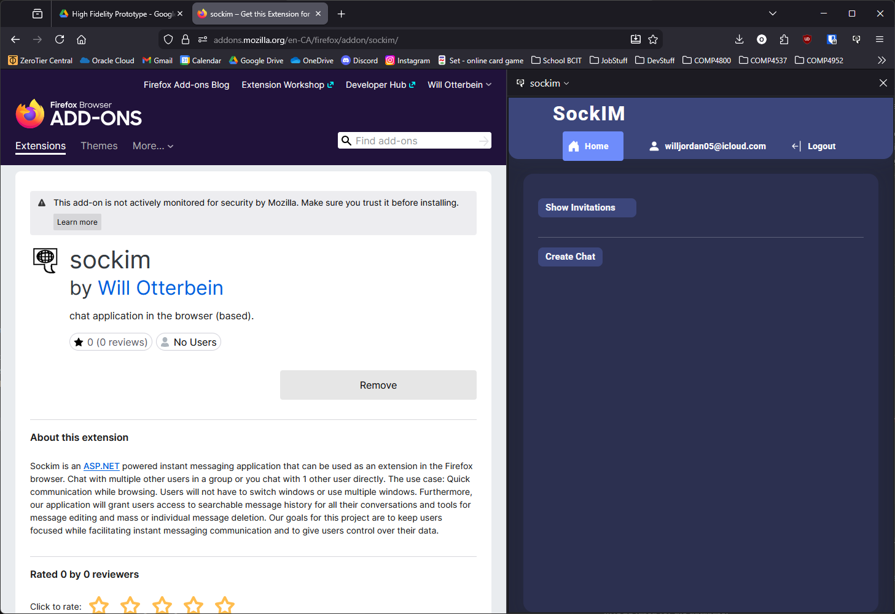
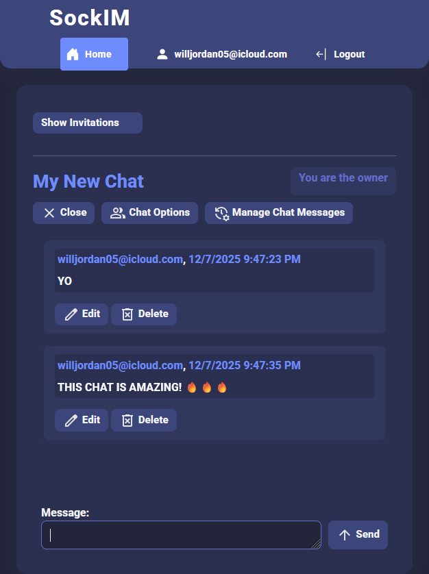
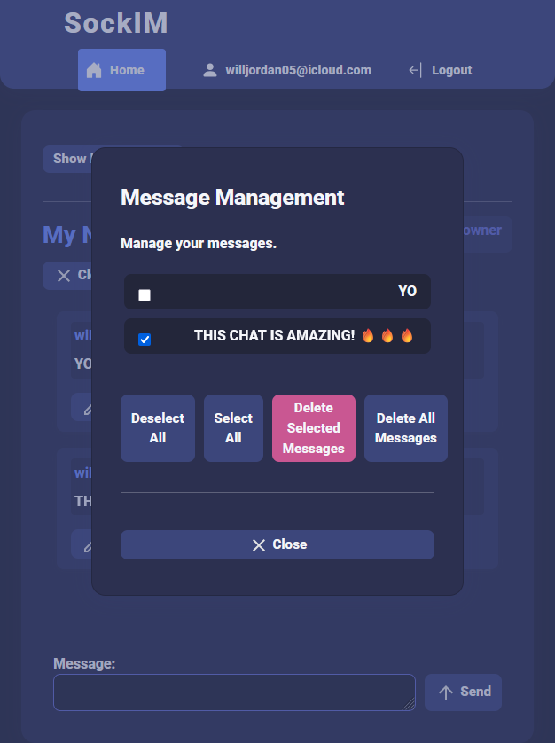

---

# Sockim

Browser based instant messaging application.

You can try the application [here](https://sockim.azurewebsites.net)!

You can install the addon for Firefox [here](https://addons.mozilla.org/en-CA/firefox/addon/sockim/)!

You can see the extension repository [here](https://github.com/BetterLordWilliam/COMP4952_Sockim_Extension.git)!

## About the Application
Sockim is an ASP.NET powered instant messaging application that can be used as an extension in the Firefox browser. Chat with multiple other users in a group or you chat with 1 other user directly. The use case: Quick communication while browsing. Users will not have to switch windows or use multiple windows. Furthermore, our application will grant users access to searchable message history for all their conversations and tools for message editing and mass or individual message deletion. Our goals for this project are to keep users focused while facilitating instant messaging communication and to give users control over their data.

## Interface Screenshots

Chat in the browser (very nice).



Full control over your messages!

| | |
| --- | --- |
|  |  |

---

# Configuration For Developers

Notes about setting up the application locally for development

## Required Software

**dotnet sdk & runtime**

> [!NOTE]
> You should install the latest version of .NET 9 sdk & runtime.
> 
> At some point we will migrate to .NET 10, however the team has not had the time yet.
> ```powershell
> winget install Microsoft.DotNet.Runtime.9
> winget install Microsoft.DotNet.SDK.9
> ```
> current runtime version **9.0.11**
> current sdk version **9.0.308**

**dotnet-ef tools**

> [!NOTE]
> This is a .NET 9 application, and using the latest version of `dotnet-ef` will not work.
> ```powershell
> dotnet tool install -g dotnet-ef --version 9.0.11 --allow-downgrade
> ```

**MySQL (used for the database)**

[lts version latest tested with](https://dev.mysql.com/downloads/mysql/)

> [!NOTE]
> The development environment is configured for a machine that has MySQL installed on it.

---

## Installation

1. Fork/Clone this repository
2. In root run

```powershell
dotnet restore
```

3. Next you will need execute the script to define the database \& service account
4. Copy the path to the [`dcl.sql` sql script](./data/dcl.sql), which defines these attributes
5. Login to MySQL in a shell and execute the script (using of course your path):

```sql
source C:\\path\\to\\project\\data\\dcl.sql
```

6. Now you should be able to apply the application's migrations & possess a development ready instance of `sockimdatabase`

```powershell
dotnet ef database update
```

7. To start the application, ensure you do so using an https endpoint

```powershell
dotnet build && dotnet run --urls 'https://localhost:7029'
```

> [!NOTE]
> You may need to add a trusted certificate for https
> ```powershell
> dotnet dev-certs https --trust
> ```
